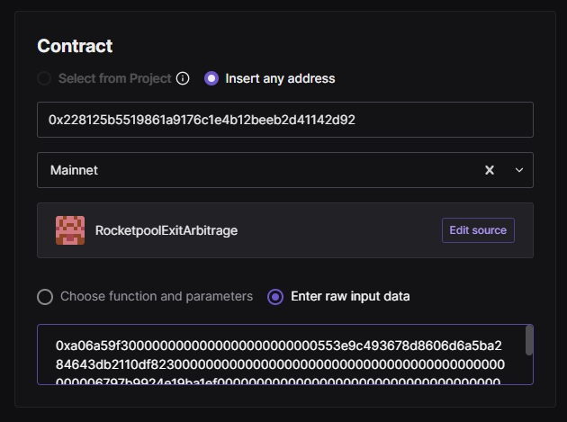
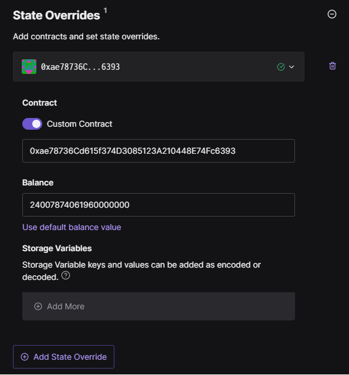
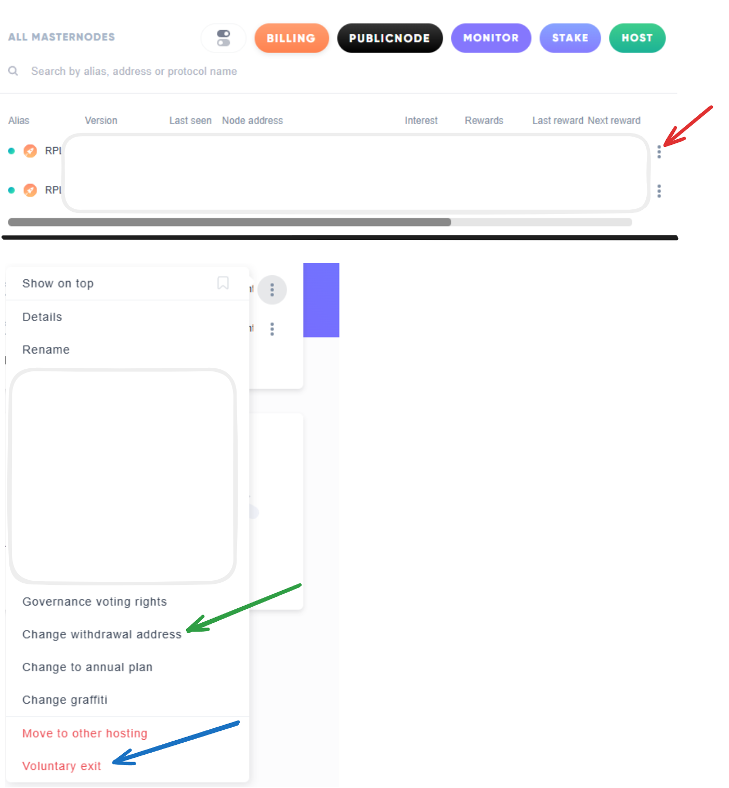

# Rocket Pool Distribute Arbitrage CLI Tool

> **WARNING**  
> This software is an **initial version** and **has not been thoroughly tested**.  
> Use at your own risk. No guarantees are provided, and we assume no liability for any potential losses or damages resulting from its use.
> The flashloan functionality has been tested and there is reasonable level of confidence in its performance (e.g. [Uniswap](https://etherscan.io/tx/0x2b047ce03e8323b1f622de3c6ce9136b4b4b13321e01b324d360786eaba392e4) or [Paraswap](https://etherscan.io/tx/0x57923f69bd0b33648ef650b39c4e64fcbc0569a5e52ea5aad2cba8a7a85b3e79)). The rETH burn bundle was tested on holesky (e.g. [burn](https://holesky.etherscan.io/tx/0x7bc144b4e2014c815f5f77d23385a52c178e1e354326f04c8a5e396555a3b984)).
> Always review the code and run your own tests before using it in a production environment.

---

## Overview

This repository contains a CLI (Command-Line Interface) tool designed to help **capture arbitrage opportunities** created by distributing minipools.  
Whenever you call **distribute** on a pool, it sends the Rocket Pool share to the rETH contract, allowing more rETH to be burned in exchange for ETH.  
When **exiting minipools** or **claiming ETH**, it is vital to check for arbitrage opportunities that would otherwise be captured by third parties.

The core objective is to leverage **distribute** calls in combination with **rETH burn** to capture potential arbitrage gains. This tool can also facilitate a **flashloan** for users who don't already hold rETH but want to capitalize on the arbitrage.

If you prefer not to run this CLI tool on your validator machine alongside the smartnode daemon—or if you don't have access to the smartnode (for example, when using a service like [Allnodes](https://www.allnodes.com/)) — you can use the `--rpc=...` flag and provide your node operator private key via `--node-private-key`. You can also use your Withdrawal Address instead, depending on what best suits your situation.

If you encounter any issues while using the tool, please open a GitHub issue so we can investigate and address it.


### Why This Tool?

- **Scenario 1**:  
  If you already hold rETH, you can bundle the **distribute** action with an **rETH burn** to recive ETH at the protocol rate.
- **Scenario 2**:  
  If you don't hold rETH, you can use a **flashloan** to obtain rETH, perform the distribute and burn, then repay the loan—collecting any remaining ETH as profit.

---

## Table of Contents
  
1. [Known Issues & Limitations](#known-issues--limitations) 
2. [Smart Contract](#smart-contract) 
3. [Requirements](#requirements)
4. [Installation](#installation)  
5. [How to simulate](#how-to-simulate)
6. [Usage](#usage)  
    - [Scenario 1: If You Already Have rETH](#scenario-1-if-you-already-have-reth)  
    - [Scenario 2: Flashloan Approach](#scenario-2-flashloan-approach) 
    - [Running the CLI tool on an external machine](#CLI-tool-on-external-machine)
    - [Allnodes users](#allnodes-users)
7. [Configuration](#configuration)
8. [License](#license)

---

## Known Issues & Limitations

- **Profit Checks with Multiple Pools**  
  When using Paraswap with low discounts and a high number of pools (via the `--minipools` flag), the tool does not perform individual profit checks for each pool. As a result, if the secondary rate crosses the primary rate, you may experience suboptimal profits. To maintain better profitability when discounts are low, it is advisable to limit the number of pools in a single call. Alternatively, you can use a Uniswap flash swap (`--protocol=uniswap`), but this approach is generally recommended only for smaller amounts—for example, exiting a single pool with 24 ETH.

---

## Smart Contract

To execute a Flashswap with Uniswap and simultaneously burn rETH within a single transaction, I developed and deployed a custom smart contract. This contract is fully verified on Etherscan and can be viewed [here](https://etherscan.io/address/0x2631618408497d27D455aBA9c99A6f61eF305559#code). The contract provides two functions. The first (`arb`) executes a flash swap arbitrage call using Uniswap. The second (`arbParaswap`) allows users to take a flash loan via [Morpho](https://morpho.org/) and perform an aggregated swap using Paraswap.


### Key Features
- **No Approvals Required:** The contract operates without needing any external approvals, simplifying its usage and reducing potential points of failure.
- **ETH-Free Transactions:** The transaction process does not involve sending any ETH, minimizing exposure to ETH-related risks.
- **Profit Receiver:** The user can decide to send the profit to an external wallet directly (withdrawal wallet by default).

### Security Considerations
While the smart contract is designed with streamlined functionality and minimal interaction with external elements, it presents a low-risk profile. However, it is important to note that this contract has not undergone a formal security audit. Users are encouraged to review the contract code on Etherscan and exercise caution when interacting with it. Always act based on your best knowledge and understanding, ensuring you are comfortable with the contract's operations and potential risks before proceeding.

---

## Requirements

1. **Go (version 1.22+ recommended)**
    - You can download and install Go from the official [Go Downloads page](https://go.dev/dl/).  
    - Refer to the official [Getting Started](https://go.dev/doc/install) guide for further instructions.  
    - Earlier versions (e.g., 1.20, 1.21) may still work, but are **not** tested.

2. **Access to a Web3 Provider**
    - Typically this is your **Rocket Pool Eth1 client** (e.g., Geth, Nethermind).
        - This can also be a WEB3 provider like [infura](https://docs.metamask.io/services/get-started/infura/). Set the full RPC URL with `--rpc ...` 
    - Ensure that your Rocket Pool setup has `Expose RPC Ports` configured to `Open to Localhost`.

3. **Minipool Exit Completed**
    - To finalize a minipool and distribute the full 32 ETH, the validator must be **exited from the consensus layer**.  
    - Use the **Rocket Pool** command `rocketpool m e` to initiate the exit.  
        - For Allnodes, users, click the 3 dots to the right of your minipool and select `Voluntary exit`.
    - Wait until the exit is fully processed and ETH is withdrawn from the consensus layer before proceeding with distribution.  
    - You can monitor progress in your node logs or by using on-chain explorers to confirm that ETH has been returned.

---

## Installation

For this initial version, **no binaries are provided**. You will need to **install Go** (1.22+ recommended) and build from source:

1. **Clone this repository**:

    ```bash
    git clone https://github.com//0xtrooper/RocketpoolExitArbitrage.git && cd RocketpoolExitArbitrage    
    ```

2. **Build the binary**:

    ```bash
    go build ./cmd/distribute/
    ```

    **Note**: This will download the necessary packages if they are not already cached.

3. **Run the CLI tool**:

    ```bash
    ./distribute --help
    ``` 

---

## How to simulate

You can use the `--dry-run` option to generate an example bundle without executing it. This option also displays the individual transactions involved. If you are using this tool to burn rETH, the transactions will always be printed. As that action is not time sensitive, take your time to confirm the transactions. They can be simulated using tools like [Tenderly](tenderly.co). 
Since the transactions are sent as part of an MEV bundle, their execution depends on the state resulting from the previous transactions. Therefore, it is essential to update the chain state while simulating. Our primary focus is on the final transaction, as it executes the arbitrage.
Below is an example of the `dry-run` option:
```
Any profit will be sent to 0x1..2. This should be your withdrawal address.
Updated flashbots fee refund recipient to 0x1..2.
Current gas settings: base fee per gas is 5.13 gwei, tip is 0.01 gwei.
Sending transaction with a base fee per gas of 7.70 gwei for timely inclusion.

Calculated distribution amounts: 8.004334 ETH sent to NO, 24.007874 ETH sentto rETH contract.

If you want to use tenderly to simulate the arbitrage, you need to overwrite the state for the final transaction:
    - Set the ETH balance of the rETH contract (0xae78736Cd615f374D3085123A210448E74Fc6393) to 24007874061960000000

Calculated rETH to burn: Burning 21.327726 rETH for 24.007874 ETH at a primary ratio of 1.12566.

Uniswap: Swapping 23.882143 WETH to 21.327726 rETH at a secondary ratio of 1.11977 with a minimum profit of 0.125732. (pool 0x553e9C493678d8606d6a5ba284643dB2110Df823)

Simulated bundle (success):
    Expected profit after fees: 0.119380, with a tx fee of 0.006351
    Expected profit after arbitrage fees: 0.123230, with a tx fee of 0.002502 (interesting if you want to distribute regardless)

Dry run. Would have sent the following bundle:
Transaction 1:
    From: 0x8..C
    To: 0x7..4
    Value: 0
    Gas Limit: 500000
    Base Fee: 7698278631 (7.70 Gwei)
    Priority Fee: 5477241 (0.0055 Gwei)
    Nonce: 184
    Data: 5..0
Transaction 2:
    From: 0x8..C
    To: 0x228125B5519861a9176c1E4b12beeb2d41142D92
    Value: 0
    Gas Limit: 325000
    Base Fee: 7698278631 (7.70 Gwei)
    Priority Fee: 5477241 (0.0055 Gwei)
    Nonce: 185
    Data: a..9
```

As you can see, it prints the necessary state updates.

To simulate the arbitrage transaction, open Tenderly and navigate to the "Simulator" page. From there, create a new transaction. Enter the details for `Transaction 2` as follows:
1. First the `To` address.
2. Select `Mainnet` as the network.
3. Choose the `Enter raw input data` option and paste the `Data` from the output.



Next, configure the state overwrite. Expand the `State Overrides` option on the right side and follow these steps:
1. Click `Add State Override`.
2. Select `Custom Contract` and enter the address printed in the output (rETH contract - `0xae78736Cd615f374D3085123A210448E74Fc6393`).
3. Choose the `Use custom balance value` option and input the amount from the output (here `24007874061960000000`). This represents the amount of ETH in Wei sent to the rETH contract: 



Now you can simulate the transaction. Focus on observing the `State` changes. Key things to verify include:
- The balance change in the receiver's address.
- Ensuring the `rETH` contract balance remains mostly unchanged.
- If burning local rETH: Make sure the correct amount is burned and the ETH is send to the correct address.

Additionally, you could review the emitted events. When executing an arbitrage: Look for the `Arbitrage` event, which displays details such as the `receiver` and the `profit` (before fees).

---

## Usage

### Scenario 1: If You Already Have rETH

In this scenario, you already possess rETH and aim to burn it at the protocol rate. The CLI tool facilitates the process by bundling the **distribute** action with an **rETH burn**. You can select this scenario with the `--local-reth` flag. When using smartnode with the default docker configuration, you usually only need to add the address (`--minipool` or `--minipools`). If you modifyed the default port, use the  `--rpc-port` flag to set the new port. If you have an external eth1 client, use the `--rpc` flag.

Because no secondary markets are involved, **this scenario is not time-sensitive**. Therefore, it is **highly recommended** to use external tools to simulate the displayed transactions and confirm they perform as intended.

The workflow proceeds as follows:

**1. Confirmation:** Once all calculations are complete, you will be prompted to confirm whether to proceed. This step allows you to verify that the ratios and amounts are accurate and meet your expectations.

**2. Submission:** After confirmation, the bundle is sent to multiple relays and remains valid for inclusion in the next five blocks.

**3. Inclusion Monitoring:** The script then monitors the network, waiting for the transactions within the bundle to be included in a block.

### Scenario 2: Flashloan Approach

In this approach, the CLI constructs a transaction bundle that initially distributes all pools specified with the flags. It then adds an arbitrage transaction calculated based on the total amount of ETH collected. When using smartnode with the default docker configuration, you usually only need to add the address (`--minipool` or `--minipools`). If you modifyed the default port, use the  `--rpc-port` flag to set the new port. If you have an external eth1 client, use the `--rpc` flag. 

There are two different ways to execute the arbitrage call. The first method involves a Uniswap flash swap arbitrage as described in the [Uniswap documentation](https://docs.uniswap.org/contracts/v2/concepts/core-concepts/flash-swaps). In this method, rETH is swapped for WETH at the secondary Uniswap rate, and then rETH is burned at the protocol rate. The profit is derived from the difference between the two rates.
The second method takes a flash loan via [Morpho](https://morpho.org/) to perform an aggregated swap using Paraswap. This approach utilizes Paraswap's aggregation capabilities to find the most efficient swaps.

By default, the system fetches quotes from both methods and automatically selects the one that yields the highest profit. However, you can explicitly choose the execution method by using the `--protocol` flag:
- Use `--protocol=uniswap` to force the system to perform the Uniswap flash swap arbitrage.
- Use `--protocol=paraswap` to force the system to perform the aggregated swap via Morpho and Paraswap.

This flexibility allows you to tailor the arbitrage strategy based on your specific preferences or constraints.


The workflow proceeds as follows:

**1. Simulation:** The constructed bundle is first simulated to estimate its profitability. If the expected profit falls below a predefined threshold, the process is automatically aborted to prevent unprofitable transactions.

**2. Confirmation:** Once all calculations are complete, you will be prompted to confirm whether to proceed. This step allows you to verify that the ratios and amounts are accurate and meet your expectations.

**3. Submission:** After confirmation, the bundle is sent to multiple relays and remains valid for inclusion in the next five blocks.

**4. Inclusion Monitoring:** The script then monitors the network, waiting for the transactions within the bundle to be included in a block.

Below is an example workflow for finalizing a single minipool:
```
rocketnode:~$ ./distribute --minipools 0xC..2
Any profit will be sent to 0x2..9. This should be your withdrawal address.
Updated flashbots fee refund recipient to 0x2..9.
Current gas settings: base fee per gas is 5.03 gwei, tip is 0.01 gwei.
Sending transaction with a base fee per gas of 7.55 gwei for timely inclusion.

Calculated distribution amounts: 8.003947 ETH sent to NO, 24.007171 ETH sent to rETH contract.

Calculated rETH to burn: Burning 21.327102 rETH for 24.007171 ETH at a primary ratio of 1.12566.

Uniswap: Swapping 23.894471 WETH to 21.327102 rETH at a secondary ratio of 1.12038 with an expected profit of 0.112701. (pool 0x5..3)
Paraswap: Swapping 23.894471 WETH to 21.327102 rETH at a secondary ratio of 1.12038 with an expected profit of 0.112701.
Uniswap is better, will use Uniswap.

Simulated bundle (success):
    Expected profit after fees: 0.106471, with a tx fee of 0.006230
    Expected profit after arbitrage fees: 0.110247, with a tx fee of 0.002454 (interesting if you want to distribute regardless)

Do you want to proceed? (y/n): y

Sent bundle with hash: 0xb..8. Waiting for up to one minute to see if the transaction is included...

Distributed minipool! Arbitrage tx: https://etherscan.io/tx/0x6477ef386a2d639d83d318294f4ade78d46f5e8be41846e5a9912c56e824c31f
```

---

### Running the CLI tool on an external machine

If you prefer not to run the CLI tool on your validator machine, you can execute the tool on an external machine. Follow these steps:

1. **Set Up the External Machine**:
    - Ensure that the external machine meets the [requirements](#requirements) listed above, including having Go installed and access to a Web3 provider. This can be the smartnode client; make sure the eth1 config is set accordingly. 
    - Follow the [Installation](#installation) steps to clone the repository and build the binary on the external machine.

2. **Run the CLI Tool**:
    - Use the `--minipool`/`--minipools` flag to specify the minipools to be distributed.
    - Use the `--rpc` flag to specify the RPC endpoint of your Web3 provider.
    - Use the `--node-private-key` flag to provide the private key for the node address used as the caller.
    - Example command:
    ```bash
    ./distribute --rpc="your_rpc_url" --node-private-key="your_private_key" --minipools="0xABC123...,0xDEF456..."
    ```

By following these steps, you can safely run the CLI tool on an external machine, ensuring that your validator machine remains secure and isolated from potential risks associated with running additional software. While the tool has access to the node operator hot wallet, this address should not contain a lot of ETH. Therfor the risk is minimal. 

### Allnodes users

- **⚠ SET A SEPARATE WITHDRAWAL ADDRESS ⚠**
	- Do **_not_** use this tool if your node address is the same as your withdrawal address.
	- To set a withdrawal address, follow the red and green arrow in the screenshot. A hardware wallet is strongly recommended for your withdrawal address.
- To exit each desired minipool, follow the red and blue arrows in the screenshot.
- Refer to your wallet's documentation for how to export the private key for your node wallet. If this is a hardware wallet, note that this key is now permanently less secure as it touched an internet-attached computer. This is acceptable for a node wallet, but not a withdrawal wallet.
	- **_DO NOT export the private key for your withdrawal wallet_**
- You can then use the tool following instruction for an [Running the CLI tool on an external machine](#CLI-tool-on-external-machine)



---

## Configuration

This CLI tool is configured primarily through command-line flags. Below is a list of the flags and their functions:


---

## Local rETH

- **Flag**: `--local-reth`  
  **Type**: boolean  
  **Default**: `false`  
  **Description**: Use existing local rETH instead of taking a flashloan. If `false`, the CLI attempts a flashloan. Use this if you want to convert rETH to ETH at the primary ratio.
  **Example**:
  ```bash
  ./distribute --local-reth
  ```

---

## Protocol

- **Flag**: `--protocol`  
    **Type**: string  
    **Default**: `best`  
    **Description**: Protocol to use for arbitrage. Options: `best`, `uniswap`, `paraswap`.  
    - `best` or `b`: Fetches both variants and suggests the more profitable one.
    - `uniswap` or `u`: Uses the Uniswap protocol to execute a flash swap.
    - `paraswap` or `p`: Uses the Morpho as flash loan provider and Paraswap for the swapping.  
    **Example**:
    ```bash
    ./distribute --protocol="uniswap"
    ```

---

## Minipool (Single)

- **Flag**: `--minipool`  
  **Type**: string  
  **Default**: (empty)  
  **Description**: Single minipool address to distribute. Use this if you only want to distribute to one minipool at a time.  
  **Example**:
  ```bash
  ./distribute --minipool="0xABC123..."
  ```

---

## Minipool (Multiple)

- **Flag**: `--minipools`  
  **Type**: string (comma-separated)  
  **Default**: (empty)  
  **Description**: Comma-separated list of minipool addresses to distribute. This does not reduce the gas fee per distribute, but only one arbitrage call is needed.
  **Example**:
  ```bash
  ./distribute --minipools="0xABC123...,0xDEF456...,0x789ABC..."
  ```

---

## Receiver Address

- **Flag**: `--receiver`  
    **Type**: string  
    **Default**: (empty)  
    **Description**: Specifies the receiver address for the arbitrage profits. If not set, the node address is used by default. This address will also receive any Flashbots gas refunds (if applicable) when no personal searcher key is used. If the `--receiver` flag is not provided, the withdrawal address of the node (specified by the `--node-address` flag) will be used.  
    **Example**:
    ```bash
    ./distribute --receiver="0xYourReceiverAddress"
    ```

---

## Node Address

- **Flag**: `--node-address`
    **Type**: string  
    **Default**: (empty)  
    **Description**: Specifies the node address used as the caller to sign the transactions. If not set, the first minipool's node address is used by default. This flag should only be needed in edge cases, use carefully.  
    **Example**:
    ```bash
    ./distribute --node-address="0xYourNodeAddress"
    ```

---

## Node Address Private Key

- **Flag**: `--node-private-key`
    **Type**: string
    **Default**: (empty)
    **Description**: Specifies the private key for the node address used as the caller. This can be used if the script should not use the Rocket Pool daemon to sign transactions. For example, when using external services like Allnodes.
    **Example**:
    ```bash
    ./distribute --node-private-key="your_private_key"
    ```

---

## Debugging

- **Flag**: `--debug`  
  **Type**: boolean  
  **Default**: `false`  
  **Description**: Enables detailed debug logs. If set to `true`, the CLI outputs verbose diagnostic information.  
  **Example**:
  ```bash
  ./distribute --debug
  ```

---

## Command Override

- **Flag**: `--command`  
  **Type**: string  
  **Default**: `docker exec rocketpool_node /go/bin/rocketpool`  
  **Description**: Overrides the default command used to run the Rocket Pool smartnode daemon. Adjust if your container or binary path differs.  
  **Example**:
  ```bash
  ./distribute --command="docker exec my_node /go/bin/rocketpool"
  ```

If you are not using the Rocket Pool smartnode Docker version, this flag allows you to specify the alternative command used to make the node sign the transaction. The specified command will be executed in the following format: `<command> api node sign <unsignedTx>`

---

## Flashbots Searcher Private Key

- **Flag**: `--searcher-private-key`  
  **Type**: string  
  **Default**: (empty; if not set, a random key is generated)  
  **Description**: **Completly optional!** Private key for the searcher used in Flashbots transactions. Flashbots uses a repupation based system to controll access in times of high demand. For more information: https://docs.flashbots.net/flashbots-auction/advanced/reputation 
  **Example**:
  ```bash
  ./distribute --searcher-private-key="abcdef123456..."
  ```

---

## Ethereum RPC Endpoint

- **Flag**: `--rpc`  
  **Type**: string  
  **Default**: `http://localhost:8545`  
  **Description**: Usually, this is the Rocket Pool eth1 client. Alternatively, you can specify a different RPC endpoint if needed. Use `--rpc-port` if you only want to set a non-default port.
  **Example**:
  ```bash
  ./distribute --rpc="https://mainnet.infura.io/v3/YOUR_PROJECT_ID"
  ```

Notice: When using a free RPC connection, consider setting a rate limit to avoid overloading the endpoint. Use the `--ratelimit` flag to control the number of calls per second, ensuring compliance with provider limits.

---

## RPC Port

- **Flag**: `--rpc-port`  
  **Type**: string  
  **Default**: `8545`  
  **Description**: Use this flag if you are using a non-default port for the Rocket Pool eth1 client. Alternatively, you can use a different RPC endpoint with the `--rpc` flag.
  **Example**:
  ```bash
  ./distribute --rpc-port="9545"
  ```

---

## Skip Confirmation Prompt

- **Flag**: `--skip-confirmation` / `--y`  
  **Type**: boolean  
  **Default**: `false`  
  **Description**: If set, the CLI will skip the confirmation prompt before executing, which speeds up automated runs.  
  **Examples**:
  ```bash
  # Long flag
  ./distribute --skip-confirmation

  # Short flag
  ./distribute -y
  ```

---

## Profit Checks

- **Flag**: `--check-profit`  
  **Type**: boolean  
  **Default**: `true`  
  **Description**: If set to `true`, the CLI reverts when the expected profit is too low.  
  **Example**:
  ```bash
  ./distribute --check-profit=false
  ```

- **Flag**: `--ignoreDistributeCost`  
  **Type**: boolean  
  **Default**: `false`  
  **Description**: Reverts when the profit is too low, but does **not** consider the cost of the distribute call(s). Best used if you want to distribute rewards regardless of minor profit, but check for arbitrage at the same time.
  **Example**:
  ```bash
  ./distribute --ignoreDistributeCost
  ```

---

## Dry Run Mode

- **Flag**: `--dry-run`  
  **Type**: boolean  
  **Default**: `false`  
  **Description**: Performs a dry run without sending the bundle to Flashbots; only prints the transaction bundle.  
  **Example**:
  ```bash
  ./distribute --dry-run
  ```

---

## Ratelimit

- **Flag**: `--ratelimit`
  **Type**: int  (timeout in ms)
  **Default**: `0`  
  **Description**: Enforces rate limiting on the RPC. This is set as the time in milliseconds between each RPC call. 
  **Example**: If you are limited to four calls per second, use a timeout of 250 ms.
  ```bash
  ./distribute --ratelimit=250
  ```

---

## Combining Flags

You can combine multiple flags in a single command. For example:

```bash
./distribute --local-reth --minipools="0xABC123...,0xDEF456..." --debug
```

This example enables debug logs, uses local rETH and specifies multiple minipools.

---

## License

This project is open source and available under the [MIT License](LICENSE).

